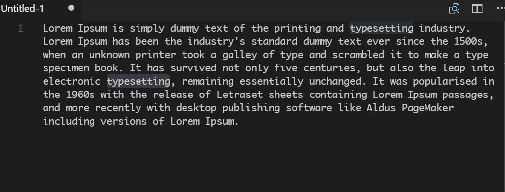

# Simple Search for Visual Studio Code

Perform a web search of selected text using a handy context menu entry.

## Features

This simple extension allows users to search for the highlighted text. The results are displayed in the default browser.

## Configuration

The search engine can be customized by editing the **QueryTemplate** parameter.

If you run into any problems, please log an issue on [GitHub](https://github.com/burcadoruciprian/vscode-simple-search/issues).

